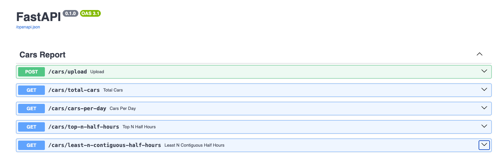

# Traffic Car Counter Service

[](https://github.com/swathiradhakrishnan06/car-counter-service/actions/workflows/devops.yml)

---

A **FastAPI-based service** to process traffic data from CSV files, compute daily summaries, top half-hour counts, and contiguous low-traffic periods. The project is designed with **modularity, testability, and DevOps practices** in mind.

---

## **Features**

* Upload CSV files with traffic counts (`timestamp` & `car_count`) via `/upload` endpoint.
* Compute:

  * Total cars
  * Cars per day
  * Top N half-hour periods
  * N contiguous half-hour periods with least cars
* Fully **tested with pytest**
* Dockerized for local and production deployment
* CI/CD setup via GitHub Actions (tests, linting, formatting and Docker image build)

---

## **Tech Stack**

* **Backend:** FastAPI, Python 3.13
* **Data Processing:** pandas
* **Testing:** pytest
* **DevOps:** Docker, Makefile, GitHub Actions

---

## **Project Structure**

```
car-counter-service/
├── app/
│   ├── main.py          # FastAPI application
│   ├── __init__.py
│   ├── config.py         # env vars via pydantic-settings
│   ├── database.py          # Database configuration
│   ├── models.py         
│   ├── services/        # Business logic
│   │   └── car_counter.py
│   └── routers/         # FastAPI endpoints
│       └── cars.py
├── tests/               # Unit and integration tests
│   └── test_services.py
├── requirements.txt
├── Dockerfile
├── Makefile
├── .github/workflows/devops.yml
└── README.md
```

---

## **Setup**

### 1. Clone and create virtual environment

```bash
git clone <repo-url>
cd car-counter-service
python -m venv .venv
source .venv/bin/activate
pip install -r requirements.txt
```

### 2. Run Locally

```bash
uvicorn app.main:app --host 0.0.0.0 --port 8080 --reload
```

### 3. Docker

```bash
docker build -t car-counter-service .
docker run -p 8080:8080 car-counter-service
```

---

## **Endpoints**



Visit the API docs at [http://127.0.0.1:8000/docs](http://127.0.0.1:8000/docs).

| Endpoint                                | Method | Description                                        |
| --------------------------------------- | ------ | -------------------------------------------------- |
| `/cars/upload`                          | POST   | Upload CSV file & get traffic summary              |
| `/cars/total-cars`                      | GET    | Get total number of cars                           |
| `/cars/cars-per-day`                    | GET    | Get cars counted per day                           |
| `/cars/top-n-half-hours`                | GET    | Get top N half-hour periods                        |
| `/cars/least-n-contiguous-half-hours`   | GET    | Get N contiguous half-hour periods with least cars |

---

## **Testing**

Run all tests with coverage:

```bash
python -m pytest -vv --cov=app --cov-report term-missing tests/test_*.py
```

---

## **Linting & Formatting**

* **Black** (code formatting)

```bash
black **/*.py
```

* **Pylint** (static code analysis)

```bash
pylint --disable=R,C **/*.py
```

---

## **CI/CD**

* GitHub Actions runs on each push:

  * `pytest` with coverage
  * `black` formatting check
  * Docker image build

---

## Enhancements (Planned)

1. **Database Integration**

   * Replace in-memory storage with **PostgreSQL** (via SQLAlchemy).
   * Insert uploaded data directly into DB and query via endpoints.
   * ✅ Work in progress: available on `dev` branch.

2. **Big Data Support**

   * Migrate computation-heavy queries to **Apache Spark** for handling datasets of 100k+ rows efficiently.

3. **Cloud Deployment**

   * Deploy service on **AWS Lambda** (serverless) or **AWS ECS** (containerized).
   * Use CI/CD pipeline for automated deployment.

## Branch Strategy

* `main`: stable version with in-memory DataFrame.
* `dev`: ongoing DB integration + updated tests.